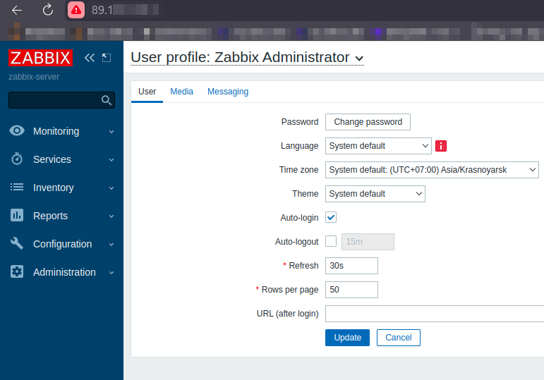
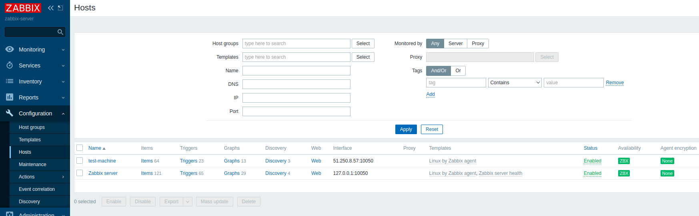
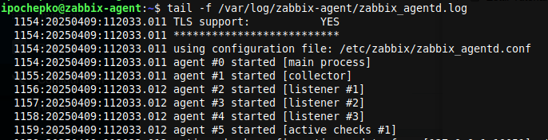
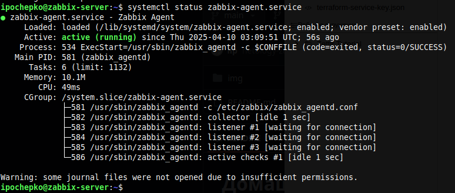
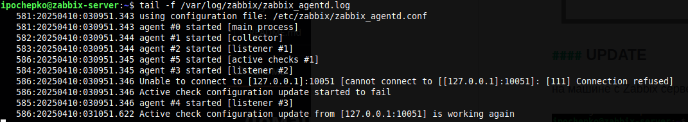
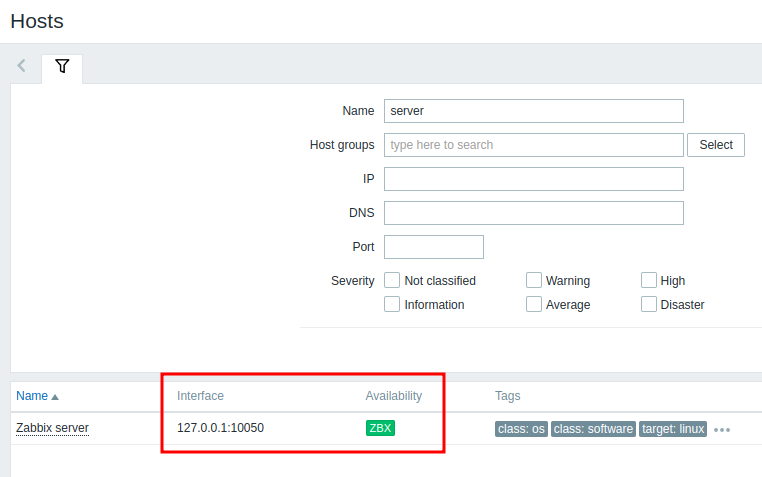
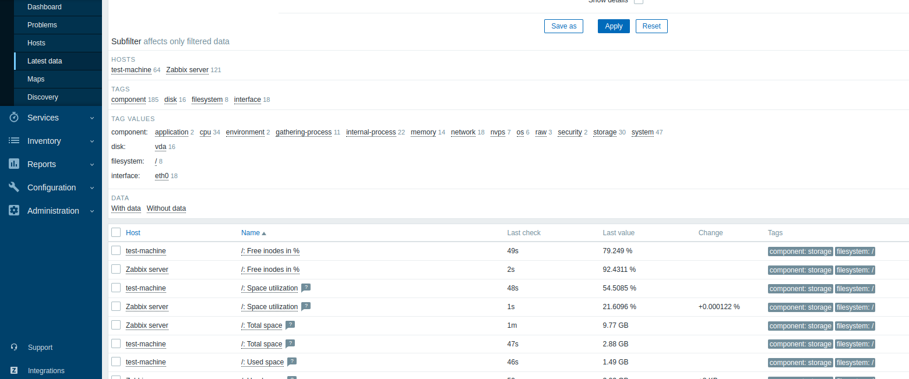

# Домашнее задание к занятию "`Система мониторинга Zabbix`" - `Почепко Илья`

### Задание 1

Установите Zabbix Server с веб-интерфейсом.

#### Процесс выполнения

1. Выполняя ДЗ, сверяйтесь с процессом отражённым в записи лекции.
2. Установите PostgreSQL. Для установки достаточна та версия, что есть в системном репозитороии Debian 11.
3. Пользуясь конфигуратором команд с официального сайта, составьте набор команд для установки последней версии Zabbix с поддержкой PostgreSQL и Apache.
4. Выполните все необходимые команды для установки Zabbix Server и Zabbix Web Server.

#### Требования к результатам

1. Прикрепите в файл README.md скриншот авторизации в админке.

   
3. Приложите в файл README.md текст использованных команд в GitHub.

wget https://repo.zabbix.com/zabbix/6.0/debian/pool/main/z/zabbix-release/zabbix-release_latest_6.0+debian11_all.deb

dpkg -i zabbix-release_latest_6.0+debian11_all.deb

sudo apt update

sudo apt install zabbix-server-pgsql zabbix-frontend-php php7.4-pgsql zabbix-apache-conf zabbix-sql-scripts zabbix-agent

sudo -u postgres createuser --pwprompt zabbix

sudo -u postgres createdb -O zabbix zabbix

zcat /usr/share/zabbix-sql-scripts/postgresql/server.sql.gz | sudo -u zabbix psql zabbix

nano /etc/zabbix/zabbix_server.conf

systemctl restart zabbix-server zabbix-agent apache2

systemctl enable zabbix-server zabbix-agent apache2

### Задание 2

Установите Zabbix Agent на два хоста.

#### Процесс выполнения

1. Выполняя ДЗ, сверяйтесь с процессом отражённым в записи лекции.
2. Установите Zabbix Agent на 2 вирт.машины, одной из них может быть ваш Zabbix Server.
3. Добавьте Zabbix Server в список разрешенных серверов ваших Zabbix Agentов.
4. Добавьте Zabbix Agentов в раздел Configuration > Hosts вашего Zabbix Servera.
5. Проверьте, что в разделе Latest Data начали появляться данные с добавленных агентов.

#### Требования к результатам

1. Приложите в файл README.md скриншот раздела Configuration > Hosts, где видно, что агенты подключены к серверу
   
3. Приложите в файл README.md скриншот лога zabbix agent, где видно, что он работает с сервером
   

#### UPDATE

на машине с Zabbix сервером также установлен и запущен Zabbix-agent:

И в админке видно, что сервер получает данные от агента установленного на него же (127.0.0.1) по порту 10050. Это удовлетворяет условиям задания "_Установите Zabbix Agent на 2 вирт.машины, одной из них может быть ваш Zabbix Server._":

   
5. Приложите в файл README.md скриншот раздела Monitoring > Latest data для обоих хостов, где видны поступающие от агентов данные.
   
7. Приложите в файл README.md текст использованных команд в GitHub

wget https://repo.zabbix.com/zabbix/6.0/debian/pool/main/z/zabbix-release/zabbix-release_latest_6.0+debian11_all.deb

dpkg -i zabbix-release_latest_6.0+debian11_all.deb

apt update

apt install zabbix-agent

systemctl restart zabbix-agent

systemctl enable zabbix-agent

nano /etc/zabbix/zabbix_agentd.conf

systemctl restart zabbix-agent.service
